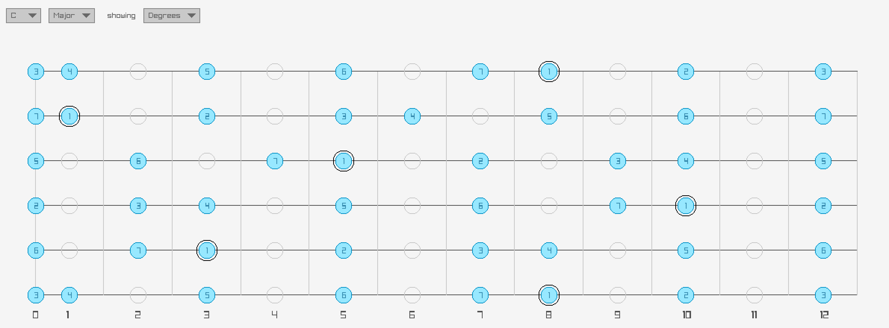

# Fret Not

A guitar practice tool built around one idea: everything you practice should be reusable when you compose, perform, or improvise. Not six separate tools bolted together — one system that carries you from *practice → composition/performance/improvisation*.



Yes, there's already a billion fretboard apps and tab editors out there. No, this isn't trying to be better than all of them. But it's mine, it's fully offline, and it's built around a specific idea about how practice material should be represented.

## The core idea

Most practice tools either show you a fixed shape on the fretboard, or a fixed tab of a song — both tied to specific frets and strings. This tool is built around a different core unit: a **chunk**, which is a *movable pattern* — a sequence of notes defined by scale degree and rhythm relative to a key, mode, and time signature, not by fixed fret positions.

Because a chunk is abstract, it can be:
- **Projected** onto the fretboard or into tab notation, in any key, at any position on the neck.
- **Extracted** back out of a tab you're learning, so a lick from a real song becomes a reusable, transposable chunk.
- **Varied** — add or remove a note, re-permute its rhythm across different groupings, sequence multiple chunks together (the "ABC method"), swap pieces in and out, layer polyrhythms, or write phrases that cross the barline.
- **Put in context** of a song you're practicing — same key, same target tempo, same chord sequence — so exercises and improvisation material feel connected to the music, not abstract drills.

That abstract-pattern ↔ concrete-fretboard/tab bridge is the architectural core of the whole project. Every feature is either building that bridge, feeding chunks into it, or consuming chunks out of it.

## Qualities

- **Fully offline.** No server, no webapp. Everything runs locally.
- **Fast.** Minimal startup time — this gets opened and closed constantly during a practice session.
- **Pretty.** This gets looked at a lot. Visual polish matters, not just function.
- **Minimal dependencies.** A small, deliberate set of libraries — not a pile of them.

## Definitions

- A **Key + Mode** defines an ordered set of scale degrees.
- A **Chunk** is a sequence of those degrees plus rhythm, scoped to a key/mode/time signature — the movable building block.
- An **Arrangement** sequences multiple labeled chunks together, with room to vary and swap pieces.
- A **Tuning** resolves abstract degrees to concrete fretboard positions, and vice versa — this is the projection/extraction bridge.
- A **Tab** is a concrete, notated sequence of fretboard positions and rhythm, belonging to a **Song**.
- An **Exercise** is a named chunk (or small arrangement) plus the recipe used to generate it (e.g. "3-notes-per-string, full neck, E Dorian").
- A **Song** carries its own key, target tempo, time signature, and chord sequence, so exercises/chunks can be viewed *in context* of it.

```
Key ─┬─ Mode ─►Chunk ─┬─projected onto─►Fretboard Position(s) (via Tuning)
     │                └─composed into─►Arrangement (ABC sequencing)
     └─Song ──contains──►Tab (concrete) ──excerpt──extracted into──►Chunk
                 └─supplies Key/Mode/BPM/Chords to──►Practice Context
Chunk ──Variation Rule──►derived Chunk (parent-child lineage)
Exercise = named Chunk + generation recipe (fretboard region, notes-per-string, etc.)
```

## Build & run

Needs [devenv](https://devenv.sh) for the toolchain (OCaml 5.4.1, dune, and the raylib/raygui build deps — see [`contributing/devenv-reference.md`](contributing/devenv-reference.md) and [`contributing/dune-reference.md`](contributing/dune-reference.md)).

```sh
devenv shell                     # enter the dev environment
dune build                       # build everything
dune exec bin/main.exe           # run the app
dune test                        # run the test suite
dune build @fmt --auto-promote   # apply formatting fixes
```

## Status

What's actually been built lives in [`worklog/`](worklog/); what's next is in [`todo.md`](todo.md).
