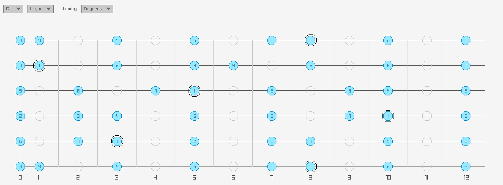

# Fret Not



A guitar practice tool who's objective is to integrate small ideas derived from
songs, basic drills, or exploratory ideas into your vocabulary as easily as
possible. In other words, it's meant to go from practice to improvisation
and composition as seemlessly as possible.

The practice tool is meant to alleviate a lot of the barriers when exploring an
idea. It's not easy (especially for novices) to go from one idea and translate
that idea around a key or even around the fretboard. It's also not obvious in
the beginning what the point of the rudiments are or how they fit together in
the common musical terminology that we use.

Fretboard visualization tools and tab writting tools are a dime a dozen. This
tool is aimed to explore other ideas around practice tools based on idea from
two books
- JP Bouvet's excellent [On Drumming](https://jpbouvetmethod.com/on-drumming)
- Benny Greb's equally excellent [Effective Practice for Musicians](https://bennygreb.de/produkt/epm-paperback/?v=7c6d99660c8a)

> But wait?!? Aren't those drummers? This is a guitar practice tool!?!

Yup. Well I'm a drummer as well. I wanted to apply the same practice principles
from drumming to the guitar and see how it goes.

# Core Idea

The idea is to manipulate small groupings of notes, which I'm calling chunks, to
explore the combinations between different chunks. If you can play a chunk in many
different positions, many different keys, interwoven with many other chunks, then it
becomes effortless to improvise with that idea.

The analogy is very similar to natural languages; individual notes are like letters of
a word, a chunk is similar to a word. Once you learn enough words and become proficient
with structuring sentences with them, then integrating new words and composing new sentences
into poems, stories, essays and other forms of expression is a natural effect.

The actual model of a chunk is using the natural scale degree note with the octave relative
to the root anchor note, or silence (aka a rest). Then paired with the key, the anchor note
on the fret board and the rhythmic base, you get actual positions that you can practice.

For example, a major arpeggio would be
```
1 3 5
```
making it a group of three. If you put that into C Major over triplets anchoring around
fret 8 of the bottom E string, you get
```
E8 E12 A10
```
or
```
E8 A7 A10
```

but you could also project this over the rest of the chords in that key which are used
in chord progressions (like the classic I-IV-V chord progression)

```
(I)  E8  A7  A10
(IV) A8  D7  D10
(V)  A10 D9  D12
```

You can imagine how this would map out over the fret board. There's many places to play
this idea which maps neatly over major, minor, diminished chords or any of the modes. The
chunk primitive remains the same. Pair that with other chunks and you get this combinatorial
explosion of phrases not even counting the rhythmic context yet.

# Status

The project is in experimental and prototyping phase. Expect a very in flux code base as the
ideas are being tried out and experimented with.

# Technologies being used

For the moment, I'm using
1. OCaml with the Jane Street Base library
2. Raylib for the multimedia library and gui
3. Devenv & nix for toolchain management
4. nushell for any shell scripting

Note that this project is entirely vibe coded. Part of the goal here is for me to explore that
style of development, to learn a language for work, and to make something that I'd actually use
to practice with.

Some qualities that I'm looking for are
1. Local first - no web server unless a feature demands it
2. Performance matters - a guitar practice app should be snappy and not hog 2Gb of RAM

## Getting Setup

Install [devenv](https://devenv.sh/getting-started/) then you can run
```nu
devenv shell                    # devenv will install and add all the necessary tools here
dune build                      # builds all the project's targets
dune test                       # runs the tests
dune exec bin/main.exe          # runs the application
dune build @fmt --auto-promote  # formats the code
```

devenv will also install the ocamllsp for your editor. You can simply launch it from the devenv shell
to get access to it.
